# Project 4: Design Journey

Your Team Name: Golden Beaver

**All images must be visible in Markdown Preview. No credit will be provided for images in your repository that are not properly linked in Markdown. Assume all file paths are case sensitive!**


## Client Description

[Tell us about your client. Who is your client? What kind of website do they want? What are their key goals?]

[NOTE: If you are redesigning an existing website, give us the current URL and some screenshots of the current site. Tell us how you plan to update the site in a significant way that meets the final project requirements.]

### About the Client

Our client's name is Seungyoon Hwang. She has owned the Korean restaurant Koko, which is located in Collegtown, for about a year, taking over for the previous owner. The client has tasked us with creating a website for her restaurant, because she has experienced inconveniences with not having one. For example, many customers have trouble with ordering take out over the phone because they do not have access to a menu.

### Client Selection

Our group decided to choose this client because most of our members have eaten at the restaurant before. These members have noticed that the restaurant does not have a website, and personally visited the restaurant to confirm the needs and wants of the client, which are explained below.

### Client Goals

The client has received former proposals for a site for Koko Restaurant, but were not satisfied and felt like they did not appropriately represent the restaurant. Instead, the client wants a site that is easy to navigate and shows the unique food options that Koko has to offer. They want to emphasize the quality and photography of the food but also make the site interactive and accessible for the customer. The primary goal is to engage with customers and allow them to view a gallery of food options before coming to the place in order to more easily order their food. The second goal is to be able to communicate the restaurant's hisory and mission towards the consumers and possibly communicate with them directly.


## Meeting Notes

[By this point, you have met once with your client to discuss all their requirements. Include your notes from the meeting, an email they sent you, or whatever you used to keep track of what was discussed at the meeting. Include these artifacts here.]

- April 13th, 2019
  - Client wants a colorful website design with lots of pictures
  - Client wants large and readable fonts for the website.
  - Client wants the contact information to be clearly visible.
  - Task distribution:
    - Tricia: menu, dish
    - Khalid: contact, about, review upload
    - Jinju: index, photo gallery
    - Kaitlyn: reviews, review upload
  - Rough draft of design-journey by April 15th (internal deadline)


## Purpose & Content

[Tell us the purpose of the website and what it is all about.]

The purpose of the website is to display information (menu, location, reviews) about the client's restaurant to potential customers. It is primarily informative about the client's services. The website will allow potential and current customers of the restaurant to become more familiar with the food options.

## Target Audience(s)

[Tell us about the potential audience for this website. How, when, and where would they interact with the website? Get as much detail as possible from the client to help you find representative users.]

The target audience is people living in or visiting Ithaca who want to eat out at a restaurant. The target audience will largely be made up of Asian Cornell students. The target audience would use the site to gather information about the restaurant. The site provides them information (menu, location, other people's reviews etc.) about the restaurant.

They would be able to search the menu and see pictures of the food which would help them decide if they wanted to go to the restaurant. The target audience can also see other people's review and write their own for others to see. In addition, the target audience can personally contact the client about any inquiries regarding the restaurant.

## Client Requirements & Target Audiences' Needs

[Collect your client's needs and wants for the website. Come up with several appropriate design ideas on how those needs may be met. In the **Rationale** field, justify your ideas and add any additional comments you have. There is no specific number of needs required for this, but you need enough to do the job.]

- Target Audience Need
  - **Requirement or Need** [What does your client and audience need or want?]
    - Target audience have different dietary restrictions
  - **Design Ideas and Choices** [How will you meet those needs or wants?]
    - Allow users to filter for specific dietary restrictions on menu page
  - **Rationale** [Justify your decisions; additional notes.]
    - Filtering for dietary restrictions improves accessibiliy and allows the client to cater to a wider variety of customers
- Client Requirement
  - **Requirement or Need** [What does your client and audience need or want?]
    - Client wants customers to have access to the menu with the various food options
  - **Design Ideas and Choices** [How will you meet those needs or wants?]
    - Create a page specifically for displaying the menu
  - **Rationale** [Justify your decisions; additional notes.]
    - A separate page for the menu makes the menu easy to find (e.g. can go to page via nav bar) and focuses attention on the various dishes when on the menu page
- Client Requirement
  - **Requirement or Need** [What does your client and audience need or want?]
    - Client wants customers to feel comfortable and welcomed to the website
  - **Design Ideas and Choices** [How will you meet those needs or wants?]
    - Use a simple but inviting design with bright colors
  - **Rationale** [Justify your decisions; additional notes.]
    - A simplistic design will make the website more accessible for users, and bright colors will feel more inviting
- Client Requirement
  - **Requirement or Need** [What does your client and audience need or want?]
    - Client wants lots of pictures of the food
  - **Design Ideas and Choices** [How will you meet those needs or wants?]
    - Create a page for a photo gallery of the food and include pictures throughout the website
  - **Rationale** [Justify your decisions; additional notes.]
    - A separate photo gallery will provide a group of food pictures for the users, and help the users get a sense of what the various menu items look like


## Initial Design

[Include exploratory idea sketches of your website.]

Header & Footer Templates (header.php, footer.php)
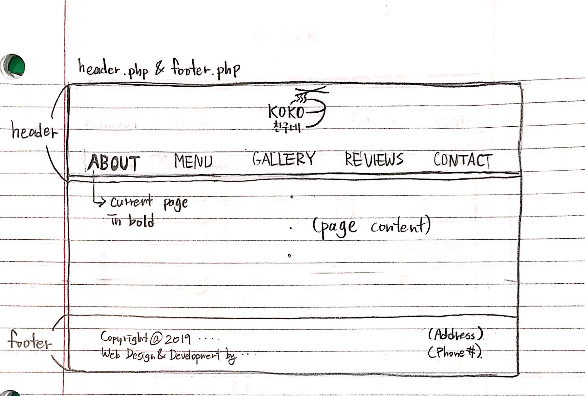

Home (index.php)
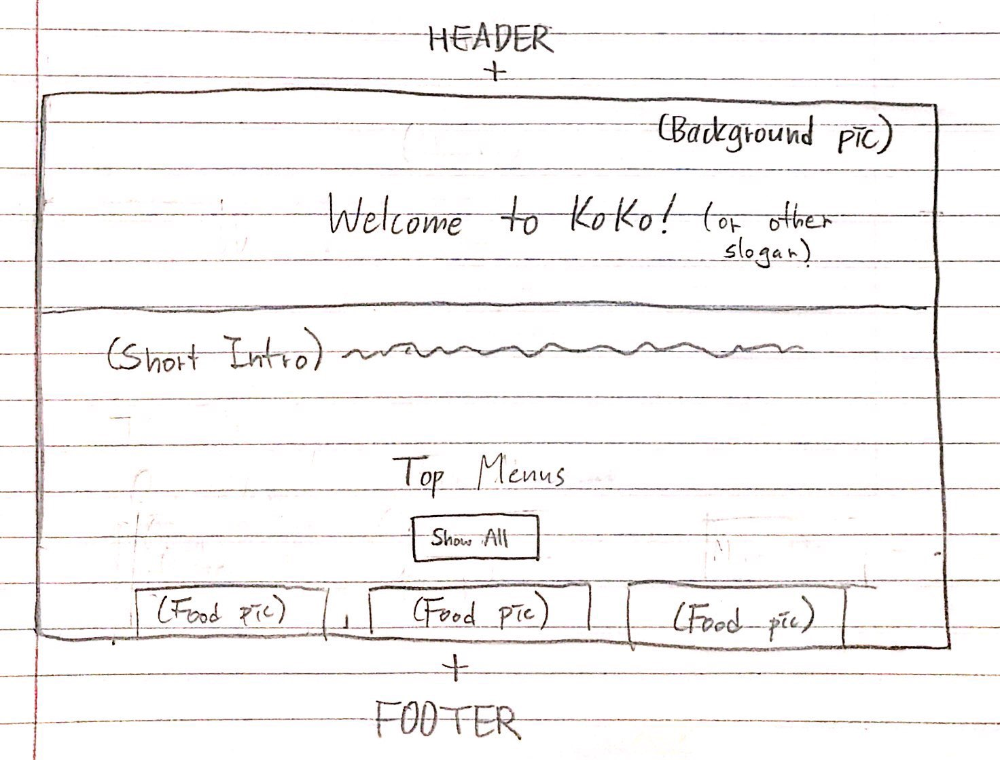

About (about.php)


Menu (menu.php)
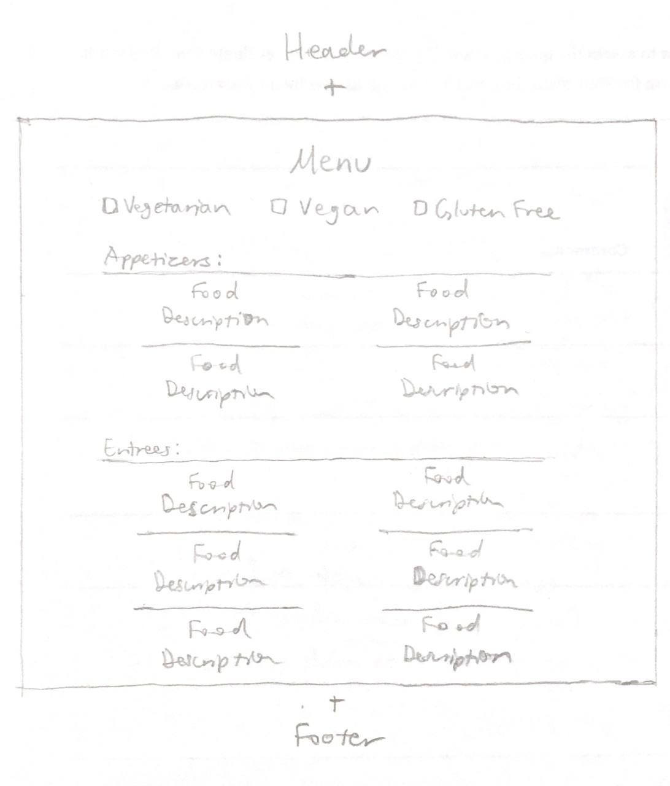

Gallery (gallery.php)
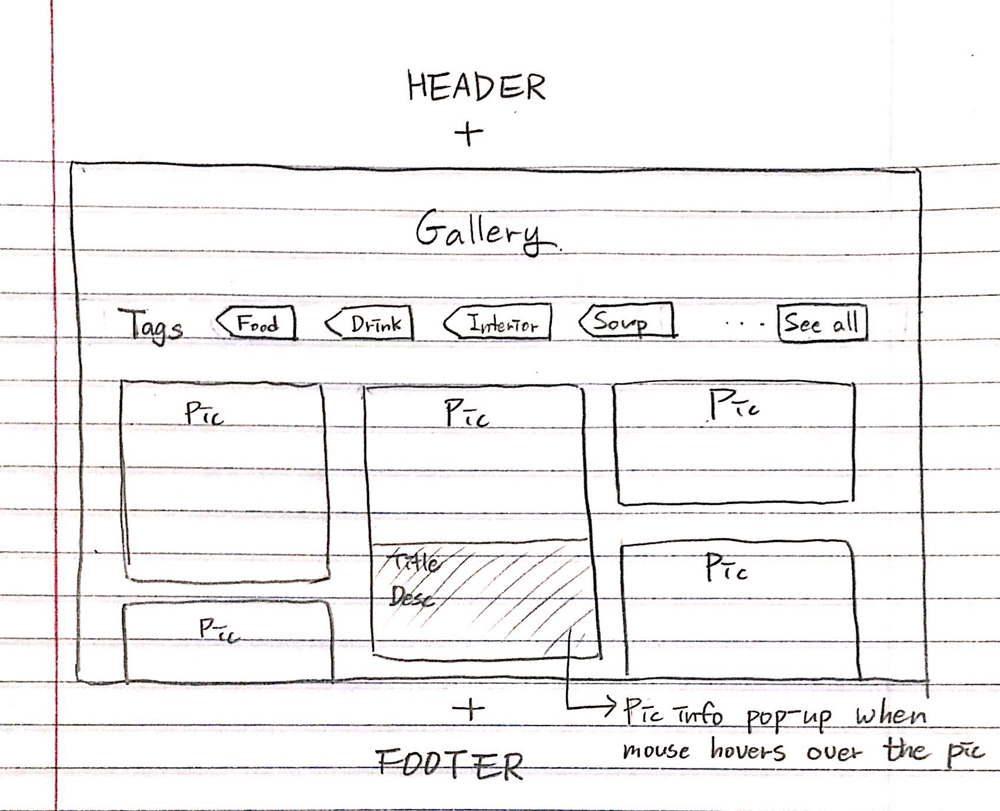

Reviews (reviews.php)
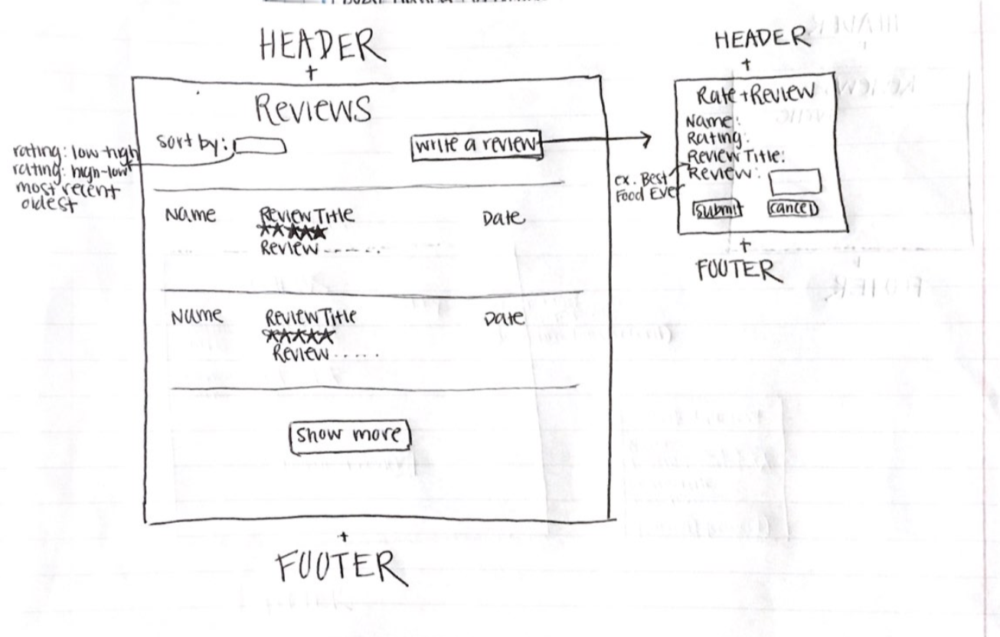

<!-- Dish (dish.php)
 -->

Contact (contact.php)
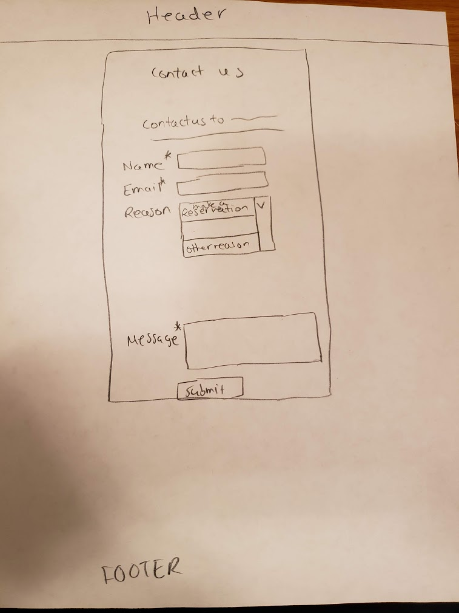

Inspirational Color Palette
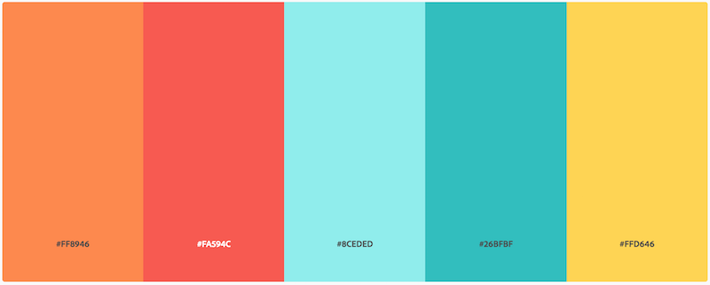

We may use these colors for designing the website to answer the client's request for a bright, colorful design. The fourth color was chosen to represent the restaurant building's color and the warm colors(red, orange, yellow) were added to represent the friendly atmosphere as well as the colors of the food served.

## Information Architecture, Content, and Navigation

[Lay out the plan for how you'll organize the site and which content will go where. Note any content (e.g., text, image) that you need to make/get from the client.]

[Document your process, we want to see how you came up with your content organization and website navigation.]

[Note: There is no specific amount to write here. You simply need enough content to do the job.]

- **Navigation**
  - Home (need to get logo from client)
  - About
  - Menu (need to get menu from client)
  - Gallery (need to get images from client)
  - Reviews
  - Dish
  - Contact

- **Content** (List all the content corresponding to main navigation and sub-categories.)
  - *Home*:
    - introduce the client's restaurant with images and short introductory sentences
    - Display few of the top menus and a link to see more menu
  - *About*:
    - explain more in depth about the restaurant
    - provide a brief history/information about Korean cuisine
  - *Menu*:
    - display menu items with descriptions
    - address dietary restrictions by allowing to filter for vegetarian, vegan, and gluten free foods
  - *Gallery*:
    - display the different albums of client's restaurant and the dishes it serves
    - Clicking on album will take user to new page of pictures of that album
    - Allow the users to select specific tags to display certain pictures
    - When the image is hovered over, display the title and description of the image as an overlay.
  - *Dish*:
    - shows the information (photo, dish name, ingredients, dietary restrictions, price, etc) about a single dish
    - clicking on menu item in menu page or photo in photo gallery page will take user to dish page
  - *Reviews*:
    - display customer reviews of clients resturant
    - Allow users to write own review of restaurant and sort through current reviews based on rating or date of review.
  - *Contact*:
    - A way to contact the resturant and submit reservations or orders
    - can ask questions

- **Process**
  - Card sort 1:
  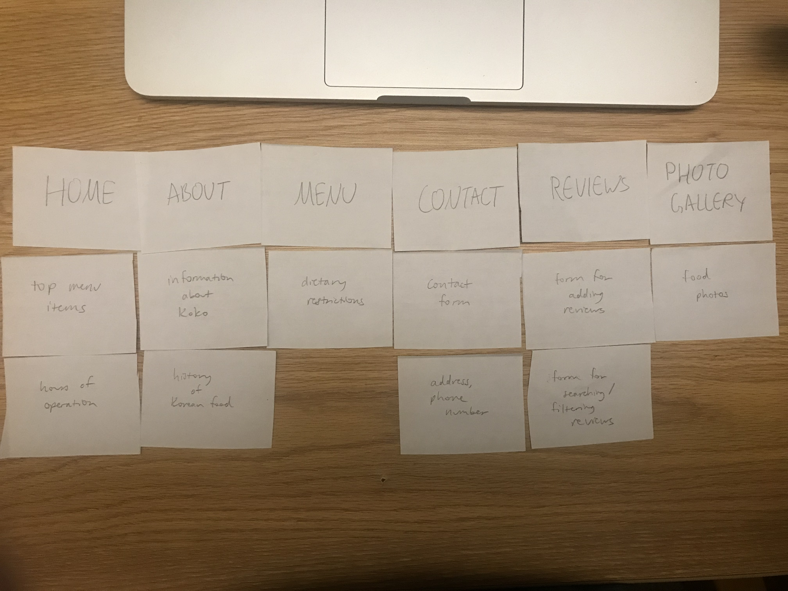
  - Card sort 2:
  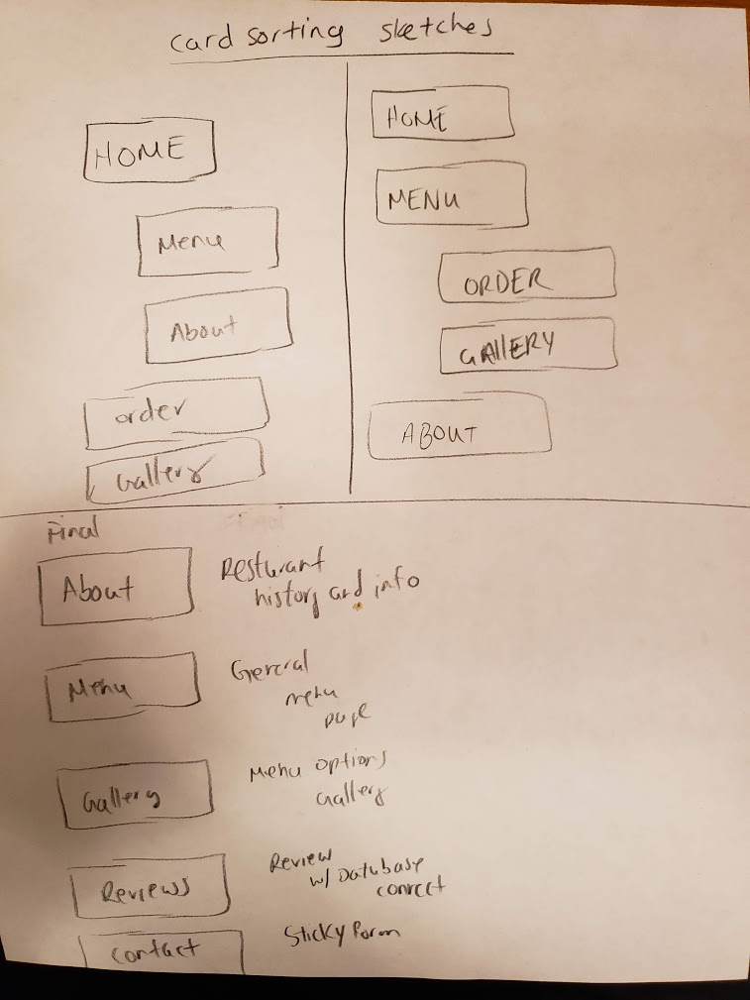
  - There were multiple ideas that we had for the different navigation items we wanted. We considered creating an animation with a dropdown menu but because the client wanted a more simple design to make the website more accessible for the target audience, we decided to create a more simple cardsort with all the navigation items in one line.

## Interactivity

[What interactive features will your site have? What PHP elements will you include?]

The site will use PHP templates for header and footer. Header template will include the website's title as well as the navigation bar which will reflect the current page the user is on. Footer template will display the copyright information for the page displayed and basic contact information of the client.

[Also, describe how the interactivity connects with the needs of the clients/target audience.]

The site will have the menu of the restaurant the user will be able to filter for dietary restrictions (vegetarian, vegan, gluten free). Clicking on the individual dishes will redirect the user to the page with detailed information on the dish, including the related images from the gallery displayed as a slideshow.

The user can also view the images of the dishes in the gallery page, which will include albums of different menu categories, dietary restrictions, etc. Clicking on an album will allow the users to view the photos inside it.

The site also will have a contact form and a review form. The contact form will allow the user to directly interact with the client, and the review form will allow the other members of the target audience. The review form will be sticky and provide responsive feedback to the user. The review page will also allow the client to get feedback about their restaurant and allow them to upload reviews, ratings, comments, and even images to the site. The review page will have a search for customers to search of reviews for their specific dish orders and will have seperate categories.

If time permits, the contact form might get connected to the menu to allow users to estimate their price (and potentially make orders) and using interactivity elements the site might have a feature to be viewed in either Korean or English.


## Work Distribution

[Describe how each of your responsibilities will be distributed among your group members.]

  - Task distribution
    - Tricia: menu, about
      - 4/17: draw sketches for about and menu pages
    - Khalid: contact
      - 4/17: draw sketches for contact page
    - Jinju: index, photo gallery
      - 4/17: write up index.php with templates first which can then be used as a template for other pages
      - 4/17: write up a css for the general styling of all the pages
    - Kaitlyn: reviews
      - 4/17: draw sketches for review page
    - All members:
      - 4/17: work on design-journey.md to complete Milestone 1

[Set internal deadlines. Determine your internal dependencies. Whose task needs to be completed first in order for another person's task to be relevant? Be specific in your task descriptions so that everyone knows what needs to be done and can track the progress effectively. Consider how much time will be needed to review and integrate each other's work. Most of all, make sure that tasks are balanced across the team.]

## Additional Comments

[If you feel like you haven't fully explained your design choices, or if you want to explain some other functions in your site (such as special design decisions that might not meet the final project requirements), you can use this space to justify your design choices or ask other questions about the project and process.]


--- <!-- ^^^ Milestone 1; vvv Milestone 2 -->

## Client Feedback

[Share the feedback notes you received from your client about your initial design.]

Client approved of our initial design. She liked the color scheme and layouts of our pages. However, the client expressed that she wanted the prices of the menu items to be on the website. The client did not find that ordering online would be neccessary because there are already multiple ways of ordering online through other sources but was ok with us adding an online order form if we wanted. This made our order form less of a priority.

## Iterated Design

[Improve your design based on the feedback you received from your client.]

Based on the design feedback we decided to introduce a dish page in order to see the individual dishes with a slideshow gallery. The dish page will display the desired dish linked from the gallery or the menu. The contact form was changed to include more items that the client wanted like access to Ithaca To Go, Deliver Ithaca w/Grubhub, pickup, more information, etc. Also the review page will now allow uploading images to the gallery which is something that will allow more interaction with the users and allow the client to have a larger array of images to display on the website.


## Evaluate your Design

[Use the GenderMag method to evaluate your wireframes.]

[Pick a persona that you believe will help you address the gender bias within your design.]

We've selected **[Abby]** as our persona.

We've selected our persona because Patricia/Patrick and Tim represent the majority of the customers of Koko. We selected Abby because she represents the minority, allowing us to address gender-inclusiveness bugs in our design. Also Abby is the least familiar with technology and so its possible to have some individuals like that who might use our website even if they are a minority.

### Tasks

[You will need to evaluate at least 2 tasks (known as scenarios in the GenderMag literature). List your tasks here. These tasks are the same as the task you learned in INFO/CS 1300.]

[For each task, list the ideal set of actions that you would like your users to take when working towards the task.]

Task 1: John, a Cornell student, has never eaten Korean food before until last week. He ate at Koko and had a wonderful experience. John wants to leave a positive review.

  1. go to Reviews Page
  2. click write review button
  3. fill out review form and submit

Task 2: Thomas is a vegetarian, and loves to eat Asian food. He heard that Koko has some of the best Asian food near Cornell University. However, he is concerned about being able to find menu options that fit his dietary restriction. Thomas wants to find photos of vegetarian menu items.

  1. click on photo gallery page in nav bar
  2. scroll to find album for vegetarian food options
  3. click on vegetarian food album


### Cognitive Walkthrough

[Perform a cognitive walkthrough using the GenderMag method for all of your Tasks. Use the GenderMag template in the <documents/gendermag-template.md> file.]

#### Task 1 - Cognitive Walkthrough

[copy the GenderMag template here and conduct a cognitive walkthrough to evaluate your design (wireframes).]

[You may need to add additional subgoals and/or actions for each task.]

**Task name: Task 1 John**

[Add as many subgoals as you needs]
**Subgoal # 1 : find reviews page**
	(e.g., "# 1 : Select the section of the document you want to print")

  - Will [persona name] have formed this sub-goal as a step to their overall goal?
    - Yes, maybe or no: [yes]
    - Why? (Especially consider [persona name]'s Motivations/Strategies.)
      John would be on the homepage of the website and there are no reviews on the page. He would know then
      to look for a different page that has reviews on it.

[Add as many actions as you need...]
**Action # 1 : click on reviews page**
	(e.g., "# 1 : Put the mouse at the beginning of the section you want to print")

  - Will [persona name] know what to do at this step?
    - Yes, maybe or no: [yes]
    - Why? (Especially consider [persona name]'s Knowledge/Skills, Motivations/Strategies, Self-Efficacy and Tinkering.)
      John is already familiar with basic website functions and the navigation bar on the website
      clearly shows the different pages. Since John wants to make a review, he would know to click the reviews label on the navigation bar.

  - If [persona name] does the right thing, will she know that she did the right thing, and is making progress towards her goal?
    - Yes, maybe or no: [yes]
    - Why? (Especially consider [persona name]'s Self-Efficacy and Attitude toward Risk.)
      Once he gets to the review page, he will be able to see different reviews as well as a the write a review button.

**Subgoal # 2 : write review**
	(e.g., "# 1 : Select the section of the document you want to print")

  - Will [persona name] have formed this sub-goal as a step to their overall goal?
    - Yes, maybe or no: [yes]
    - Why? (Especially consider [persona name]'s Motivations/Strategies.)
     John wants to write a postive review about the restaurant since he enjoyed his experience so much and wants to let others know about the great restaurant.

[Add as many actions as you need...]
**Action # 1 : click on write review button**
	(e.g., "# 1 : Put the mouse at the beginning of the section you want to print")

  - Will [persona name] know what to do at this step?
    - Yes, maybe or no: [yes]
    - Why? (Especially consider [persona name]'s Knowledge/Skills, Motivations/Strategies, Self-Efficacy and Tinkering.)
      John wants to write a review and at the top of the page there is a button that says write a review, so John would know to click on it.

  - If [persona name] does the right thing, will she know that she did the right thing, and is making progress towards her goal?
    - Yes, maybe or no: [yes]
    - Why? (Especially consider [persona name]'s Self-Efficacy and Attitude toward Risk.)
      John would be led to a different page once he clicks on the write a review button. This page would contain a form for him to fill out.

**Action # 2: fill out reviews form**
	(e.g., "# 1 : Put the mouse at the beginning of the section you want to print")

  - Will [persona name] know what to do at this step?
    - Yes, maybe or no: [yes]
    - Why? (Especially consider [persona name]'s Knowledge/Skills, Motivations/Strategies, Self-Efficacy and Tinkering.)
      The form has clear labels for each part of the review form, so John would know how to fill it out. There are also
      clear buttons for John to press depending on what he wants to do with his review (submit or cancel)

  - If [persona name] does the right thing, will she know that she did the right thing, and is making progress towards her goal?
    - Yes, maybe or no: [no]
    - Why? (Especially consider [persona name]'s Self-Efficacy and Attitude toward Risk.)
      Once he submits, there is no message that tells him that his review was succesfully submitted or succesfully cancelled.


Task 2: Thomas is a vegetarian, and loves to eat Asian food. He heard that Koko has some of the best Asian food near Cornell University. However, he is concerned about being able to find menu options that fit his dietary restriction. Thomas wants to find photos of vegetarian menu items.

  1. click on photo gallery page in nav bar
  2. scroll to find album for vegetarian food options
  3. click on vegetarian food album

#### Task 2 - Cognitive Walkthrough

**Task name: Task 2 Thomas**

[Add as many subgoals as you needs]
**Subgoal # 1 : find photos of menu items**
	(e.g., "# 1 : Select the section of the document you want to print")

  - Will [persona name] have formed this sub-goal as a step to their overall goal?
    - Yes, maybe or no: [yes]
    - Why? (Especially consider [persona name]'s Motivations/Strategies.)
      Thomas wants to find pictures of the vegetarian menu items before he goes to the actual restaurant.
      In the home page there are no pictures of the menu items, so Thomas would know to look for another page with pictures of the menu items.

[Add as many actions as you need...]
**Action # 1 : click on gallery's page**
	(e.g., "# 1 : Put the mouse at the beginning of the section you want to print")

  - Will [persona name] know what to do at this step?
    - Yes, maybe or no: [maybe]
    - Why? (Especially consider [persona name]'s Knowledge/Skills, Motivations/Strategies, Self-Efficacy and Tinkering.)
    Since Thomas wants to look at pictures of the menu items, he might click on the menu's page instead of the
    galleries page. Once Thomas clicks on the menu page and sees no pictures, he might know to then try the gallery page to find picture. However, if Thomas has especially low self efficacy, he might blame himself for the images not appearing in the menu page.

  - If [persona name] does the right thing, will she know that she did the right thing, and is making progress towards her goal?
    - Yes, maybe or no: [yes]
    - Why? (Especially consider [persona name]'s Self-Efficacy and Attitude toward Risk.)
      He would see be able to see different images of the menu items.

**Subgoal # 2 : find vegetarian menu item pictures**
	(e.g., "# 1 : Select the section of the document you want to print")

  - Will [persona name] have formed this sub-goal as a step to their overall goal?
    - Yes, maybe or no: [yes]
    - Why? (Especially consider [persona name]'s Motivations/Strategies.)
    Since Thomas is a vegetarian, he would desire to look at the pictures of the vegetarian items.

[Add as many actions as you need...]
**Action # 1: scroll to find the vegetarian food album**
	(e.g., "# 1 : Put the mouse at the beginning of the section you want to print")

  - Will [persona name] know what to do at this step?
    - Yes, maybe or no: [yes]
    - Why? (Especially consider [persona name]'s Knowledge/Skills, Motivations/Strategies, Self-Efficacy and Tinkering.)
    When Thomans is on the food gallery page, he would see different photo albums with titles that would tell the user the kind kind of photos in the albumn. Since Thomas wants to look at vegetarian dishes, he would know to look for that album. Since scrolling is fairly standard for website, Thomas would know to scroll until he found the vegetarian album.

  - If [persona name] does the right thing, will she know that she did the right thing, and is making progress towards her goal?
    - Yes, maybe or no: [yes]
    - Why? (Especially consider [persona name]'s Self-Efficacy and Attitude toward Risk.)
    He would see the vegetarian food album.

  **Action # 2: click on vegetarian food album**
	(e.g., "# 1 : Put the mouse at the beginning of the section you want to print")

  - Will [persona name] know what to do at this step?
    - Yes, maybe or no: [yes]
    - Why? (Especially consider [persona name]'s Knowledge/Skills, Motivations/Strategies, Self-Efficacy and Tinkering.)
    Since photo albums are a common way to organize photos, Thomas would be familiar with them. He would know that he has to click on the album in order to see the photos of the album.

  - If [persona name] does the right thing, will she know that she did the right thing, and is making progress towards her goal?
    - Yes, maybe or no: [yes]
    - Why? (Especially consider [persona name]'s Self-Efficacy and Attitude toward Risk.)
    He would see more photos of vegetarian dishes once he clicked on the vegetarian album.


### Cognitive Walk-though Results

[Did you discover any issues with your design? What were they? How will you change your design to address the gender-inclusiveness bugs you discovered?]

[Your responses here should be **very** thorough and thoughtful.]

Yes, in our first task we realized that there is no feedback for John to know that he succesfully submitted his review of the restaurant. Since John has lower self efficacy, he might think that he did something wrong unless he directly sees his review on the page or is given some confirmation. We will change our design to include displaying confirmation messages for succesfully submitting or cancelling a review as well as including error messages directly telling John if he forgot to fill out a certain filed in the review form.

In our second task we realized that people looking at the menu would probably want to see picture of the food items and people looking at pictures of the food would probably want to also see the menu. We will try to connect the two pages by linking them through the images.

## Final Design

[Include sketches of your finalized design.]

[What changes did you make to your final design based on the results on your cognitive walkthrough?]

The final design sketches will continue to be updated as the development progresses.

Header & Footer Templates (header.php, footer.php)


Home (index.php)


About (about.php)
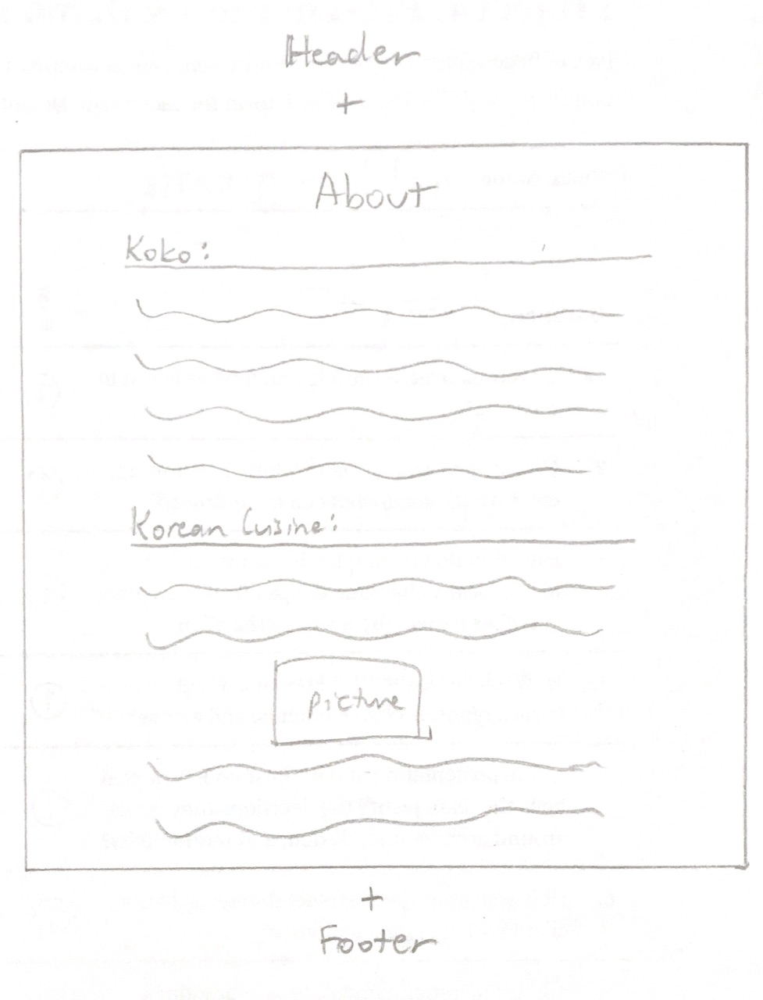

Menu (menu.php)
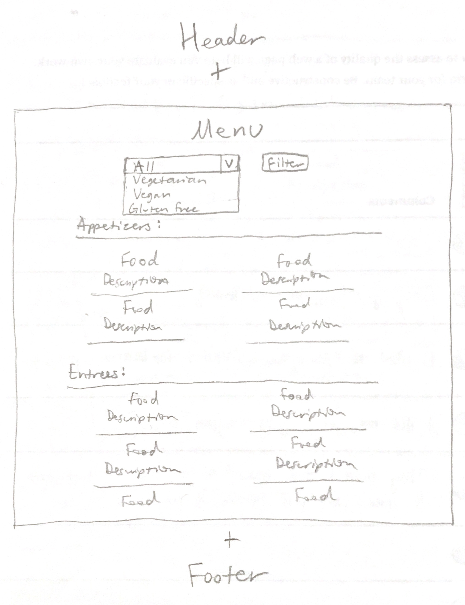

Gallery (gallery.php)
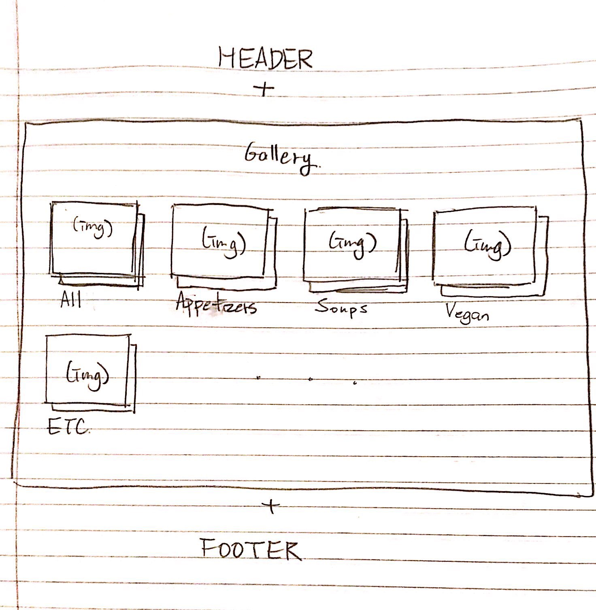

Gallery (when album is selected) (gallery.php)
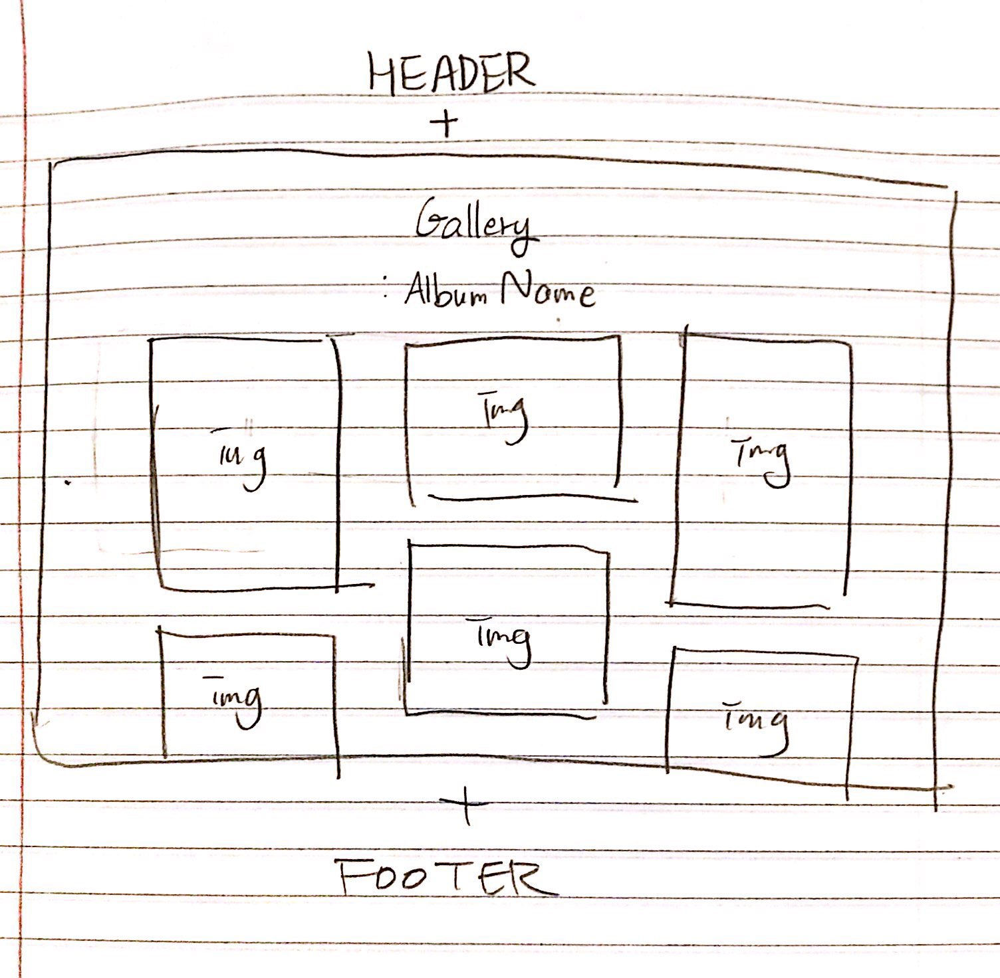

Reviews (reviews.php)
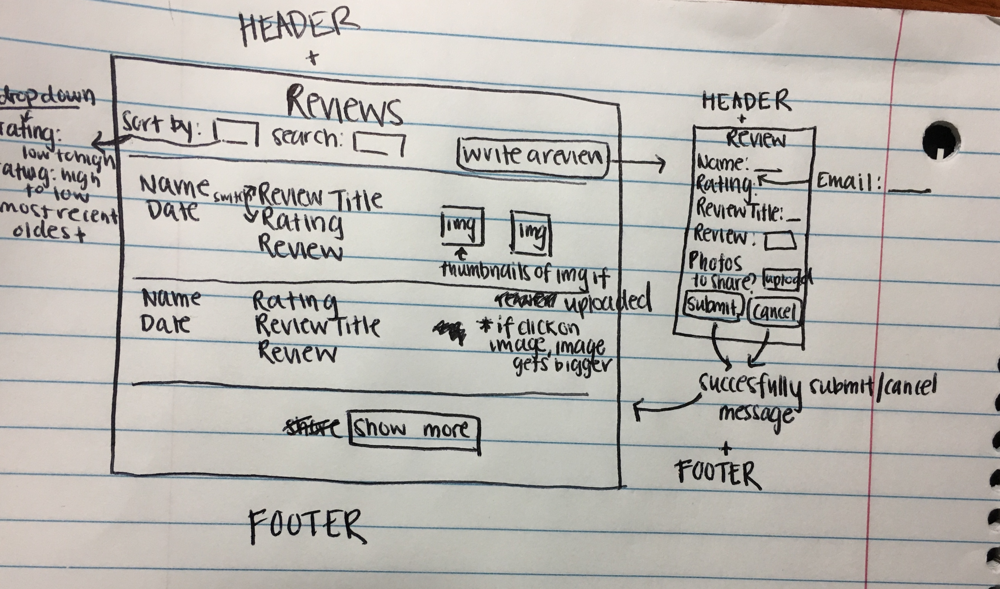

Contact (contact.php)
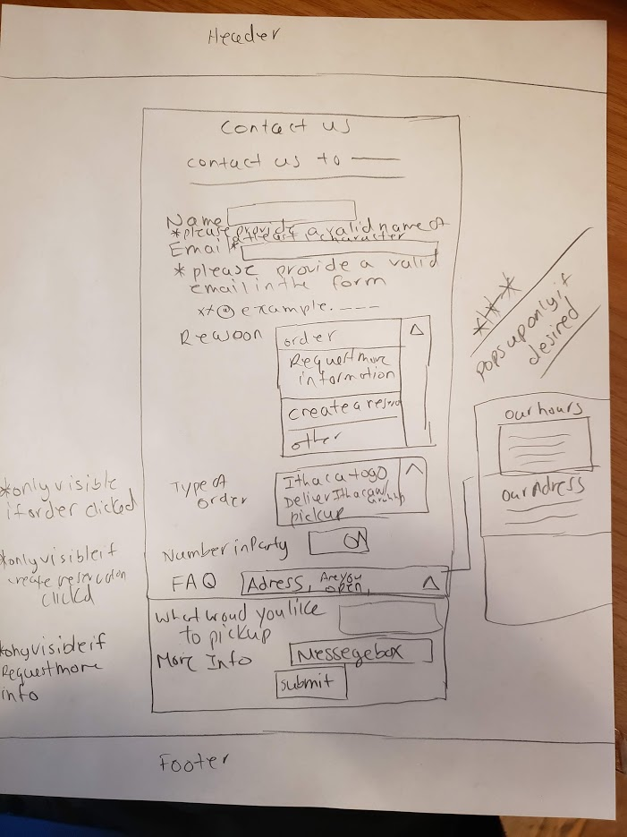

Added Pages:

Dish (dish.php)
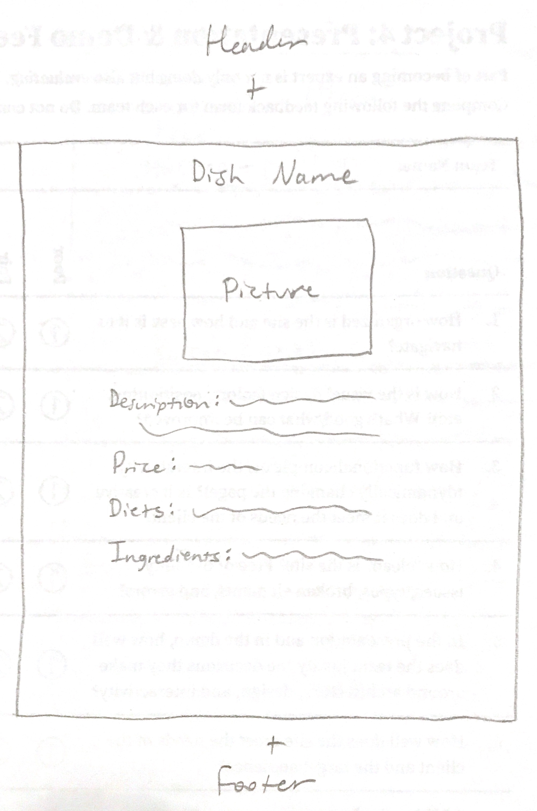

## Database Schema

[Describe the structure of your database. You may use words or a picture. A bulleted list is probably the simplest way to do this.]

Table: menu
* field 1: id
* field 2: menu name
* field 3: description
* field 4: price
* field 5: dietary restriction id
* field 6: category id

Table: categories
* field 1: id
* field 2: category

Table: dietary restriction
* field 1: id
* field 2: dietary restriction

Table: images
* field 1: id
* field 2: image name
* field 3: image extention
* field 4: menu id
* field 5: image source
* field 6: review id

Table: reviews
* field 1: id: INTEGER {PK, U, Not, AI}
* field 2: date: DATE {Not}
* field 3: reviewer: TEXT {Not}
* field 4: email: TEXT
* field 5: rating: INTEGER {Not}
* field 6: review_title TEXT
* field 7: comment TEXT
* field 8: image_id TEXT


## Database Queries

[Plan your database queries. You may use natural language, pseudocode, or SQL.]

### menu.php queries:
```
For getting all categories
SELECT * FROM categories

For getting all menu items in a certain category
SELECT menu_name, description FROM menu INNER JOIN categories ON category_id = categories.id WHERE category = :category
```

### dish.php queries:
```
For getting id of single menu item
SELECT * FROM menu WHERE id = :id

For getting the images of a single menu item
SELECT * FROM images WHERE menu_id = :id
```

### gallery.php queries:
```
For getting all albums
SELECT * FROM categories

For getting all images in an album
SELECT * from images INNER JOIN menu ON menu_id = menu.id WHERE category = :category
```

### reviews.php queries:
```
For sort by: (ex. sort by most recent or sort by highest rating)
SELECT * FROM reviews ORDER BY date ASC or SELECT * FROM reviews ORDER BY rating DESC

For search (note: will use parameter markers):
SELECT * FROM reviews WHERE comment LIKE "%search_field%"

For adding a review (will use parameter markers):
INSERT INTO reviews (id, date, reviewer, email, rating, review_title, comment, image_id) VALUES (values form the form)

Display reviews:
SELECT * FROM reviews
```

## PHP File Structure

[List the PHP files you will have. You will probably want to do this with a bulleted list.]

* index.php - main page.
* about.php
* includes/init.php - stuff that useful for every web page.
* menu.php
* dish.php
* reviews.php
* contact.php


## Pseudocode

[For each PHP file, plan out your pseudocode. You probably want a subheading for each file.]

### General Code

#### To extract info from the database:

Open the database, select all the values from the table to display, except
then create a table to input all the database values using html, then using sql code select all the values in the database and put the in array format while executing and storing all the array values in a variable. Then a function opens up all of the elements and prints them out individually as specified to be part of the table ignoring any encodings with in the characters. Every element needs to be printed in the array variable that they were stored in.

### header.php
```
for all the navigation menus
  if menu is the current page
    then highlight it
    else display it normally
```

### menu.php
```
use sql to get all categories
for each category
  create a header with the category as the text
  use sql to get all menu items in the category
  for each menu item in the category
    create a header for the menu item that links to dish.php
    show the description of the menu item
```

### dish.php
```
if id is set
  use sql to get all menu items where menu id is id
  set menu variable to the result of sql query

if menu is set
  show details of menu item (description, price, photo, etc)
```

### gallery.php
```
  Album Display:
  if get parameter for album id isn't set
    then display all the albums
    else display the pictures in the album

  Album Select:
  if user clicks on the album
    then redirect to the gallery page with get parameter set to album id
    else do nothing

  Picture Select:
  if user clicks on the picture
    then redirect to the dish page with the according menu id
    else do nothing

```

### reviews.php
```
For sort:
- If user selects a drop down option (ex. most recent), then order elements of the reviews page by that option and
display newly ordered information (ex. for most recent would order database by date in descending order)

For the search:
- If the user clicks search button check for the information inputted in search text field
- Sanitize input to prevent harm done to website
- Query to find records of database that match input (will search for input in review description and review title)
- If the records of the search match input retrive those records from the database. Then show those records to the user.

For uploading a users review (incl image):
- will use data transaction in users review form
- save all items currently in the form attributes but filter any html special characters and save them to variables to make the form sticky

  if pressed submit button:
  - check that name field was given, if not then otherwise show an error message
  - check that the email matches the appropriate specifications otherwise show an error message
  - check that a rating was given, if not show error message
  - check that a review comment was given, if not show error message
  - if user upload some file:
    - check that file is a jpeg or png otherwise display error message
  - if all fields satisfied, then display successfully submitted message and add review to database

  if pressed cancel button:
  - display sucesfully cancelled message and leave write a review form (go back to reviews)
```

### contact.php
```
Once the form is submitted:
- Scroll down to the bottom of the screen where the form location is
- Then Check that all the items that were submitted and store this in variable names for each item.
Check if the name is atleast 1 character continue to allow form to be submited
- If email is in the valid format (atleast 5 characters) also continue to allow the form to be submitted,
one item in the selection menu for reason will be selected anyway
If the comment is betweenn the required characters (25 and 500 characters) also allow the form to be submitted.
- By allowing the form to submitted have a variable act as a boolean switch to alter the validation criteria.
- If all three of these conditions are satisfied allow the form to be submitted otherwise display the error for whichever item is not satisfactory by setting the error variable to an element other than hidden.
- If the form is submitted show the variable items on the screen after paramater names or otherwise just show the same form with the errors not hidden

For accessing Database Elements from the form and then inputting them:
- Once the form is submitted (This code is written earlier), show the user the information he submitted and give him a feedback messege if it was valid or not.
- If it was valid, hide the form and post the users input in its place. Then open the database ot access it and insert the values into the database.
```

## Additional Comments

[Add any additional comments you have here.]

### Changes from Milestone 1 to Milestone 2
- More involve interactivity
- add dishes page
- search function on the reviews
- categories for the reviews
- categories for menu items
- transaction for reviews
- more involved contact page

### Mistakes on Milestone
- Interactive features are more complex than Project 3 ( Interactive features demonstrate creativity beyond just copying what's has already been done in this class.)
  - slideshow on dish page
  - transactions
  - possible translation
- Short description of work distribution includes assigned duties, work expectations, and expected internal deadlines.
- Needs and wants

--- <!-- ^^^ Milestone 2; vvv Milestone 3 -->

## Issues & Challenges

[Tell us about any issues or challenges you faced while trying to complete milestone 3. Bullet points preferred.]


--- <!-- ^^^ Milestone 3; vvv FINAL SUBMISSION-->

## Final Notes to the Clients

[Include any other information that your client needs to know about your final website design. For example, what client wants or needs were unable to be realized in your final product? Why were you unable to meet those wants/needs?]


## Final Notes to the Graders

[1. Give us three specific strengths of your site that sets it apart from the previous website of the client (if applicable) and/or from other websites. Think of this as your chance to argue for the things you did really well.]

[2. Tell us about things that don't work, what you wanted to implement, or what you would do if you keep working with the client in the future. Give justifications.]

[3. Tell us anything else you need us to know for when we're looking at the project.]
